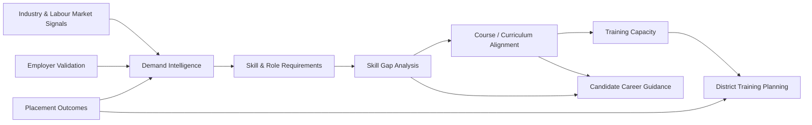
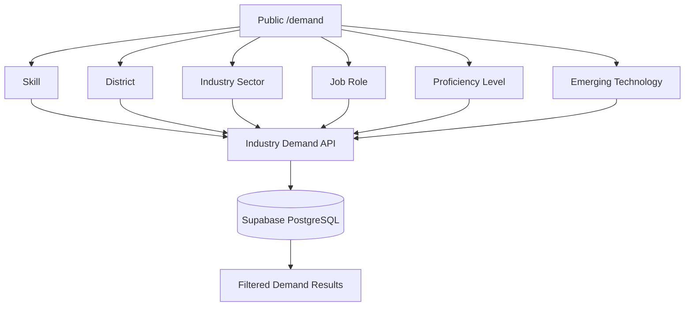
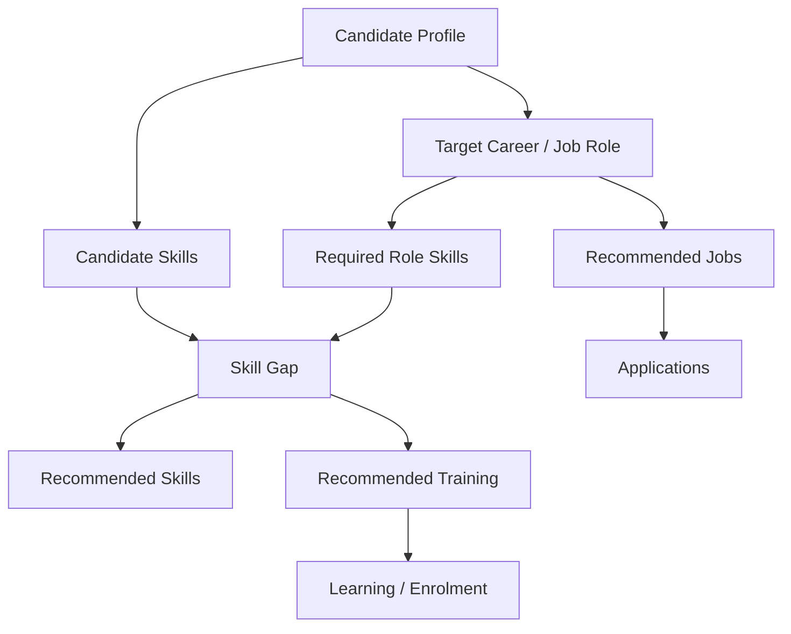
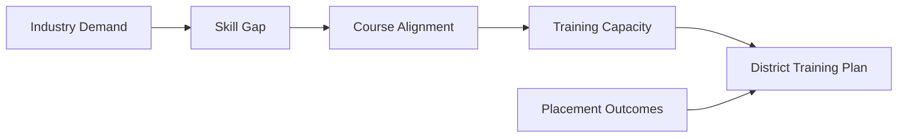
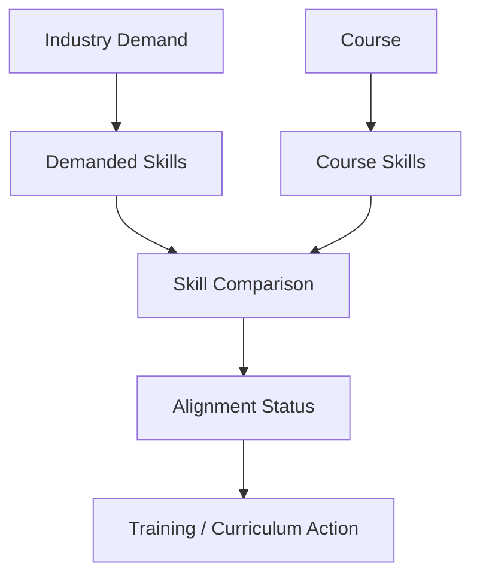
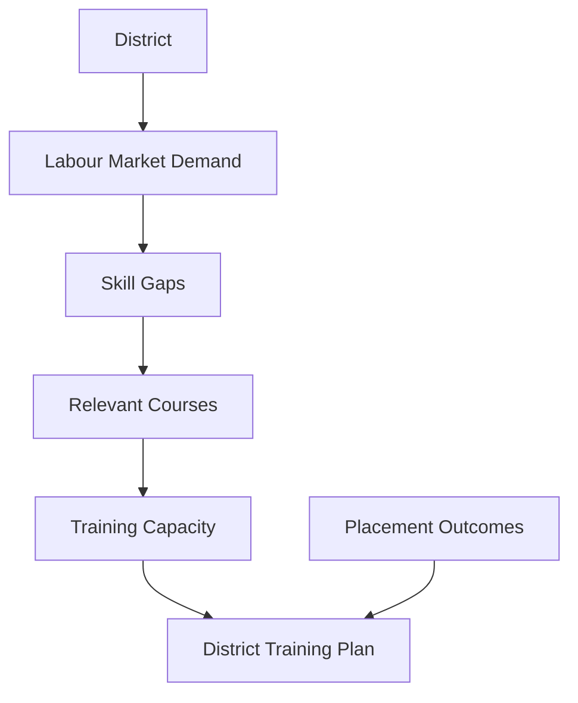
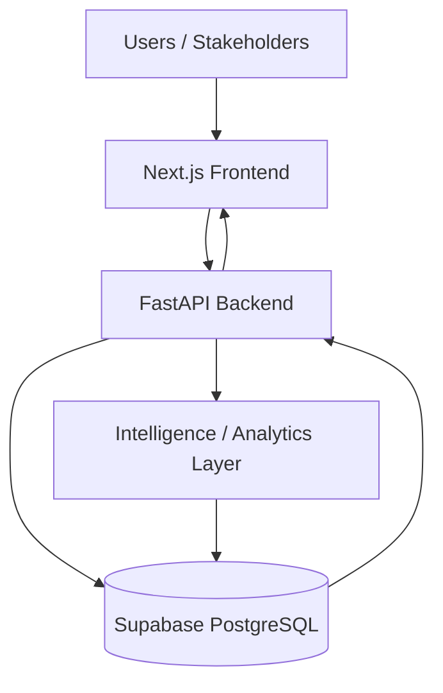
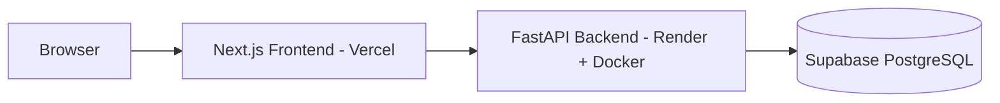

# SkillMitra

**AI-powered Labour Market Intelligence and Skill Gap Platform for Maharashtra**

---


**Smart India Hackathon 2026 — Problem Statement 26134**

> *Challenges in aligning skill development programs with industry requirements and emerging job market demands.*

SkillMitra is an evidence-driven labour market intelligence and skill development planning platform for Maharashtra. It connects industry demand, skill requirements, training capacity, and placement outcomes into a unified decision-support workflow for government, training providers, employers, and candidates.

---

## 🎯 Problem Statement

Skill development programs often become disconnected from actual employer requirements due to:

- **Labour-market demand changes** by role, skill, district, sector, and proficiency level
- **Training capacity misalignment** with current and future demand
- **Curriculum/course gaps** lacking evidence from industry requirements
- **District-level planning challenges** without localized intelligence
- **Candidate guidance gaps** without demand-aware career pathways

SkillMitra addresses these challenges by providing an integrated intelligence platform that connects the full skill development ecosystem.

---

## 💡 Solution Overview

SkillMitra is an integrated intelligence platform that connects:

1. **Labour-market demand** → 2. **Demand intelligence** → 3. **Skill & role requirements** → 4. **Skill-gap analysis** → 5. **Course/curriculum alignment** → 6. **Training capacity** → 7. **Employer validation** → 8. **Placement outcomes** → 9. **District training planning** → 10. **Candidate career guidance**

Instead of treating job demand, candidate skills, courses, and government training capacity as separate datasets, SkillMitra connects them into one decision-support workflow.

---

## 🔄 Core Decision Pipeline



---

## 🚀 How the Platform Works

1. **Industry demand is captured** from job postings, employer surveys, and market signals
2. **Demand is analysed** by district, sector, role, skill, and proficiency level
3. **Required proficiency** is considered for each skill-role combination
4. **Candidate skill supply** is compared against demand to identify gaps
5. **Skill gaps are identified** at individual and aggregate levels
6. **Relevant courses and course skills** are mapped to demand requirements
7. **Training capacity** is inspected across providers, trainers, and equipment
8. **Employer intelligence** validates workforce requirements and skill needs
9. **Placement outcomes** provide outcome signals for continuous improvement
10. **Government uses intelligence** for district-level training planning
11. **Candidates receive career, skill, and training recommendations** based on demand

---

## 👥 User Roles & Portals

| Role | Main Purpose |
|------|-------------|
| **Candidate** | Career guidance, skills, skill gaps, training, jobs, applications |
| **Industry / Employer** | Demand signalling, job postings, workforce intelligence, skill gaps, employer intelligence |
| **Government Official** | Labour-market intelligence, skill gaps, course alignment, training capacity, placement outcomes, district planning |
| **Training Provider** | Training offerings, trainers, equipment, capacity and curriculum-related workflows |

---

## 🌐 Public Demand Intelligence

The platform provides a public Demand Intelligence page at `/demand` that enables labour-market demand exploration across six required dimensions:

- **Skill** - Filter by specific skills
- **District** - Filter by Maharashtra districts
- **Industry Sector** - Filter by industry sectors
- **Job Role** - Filter by job roles
- **Proficiency Level** - Filter by skill proficiency (Beginner, Intermediate, Advanced, Expert)
- **Emerging Technology** - Filter by emerging technology categories

**Key Features:**
- Database/API-backed filtering with AND-style logic when multiple dimensions are selected
- Demand Records represent actual demand records from the database
- Demand level semantics derived from backend demand classification logic
- Honest empty states when no matching records exist
- No fabricated historical demand or fake forecast values
- Emerging Technology represented through IndustryDemand relationships

**Authenticated Industry Demand:**
- `/industry/demand` remains authenticated and separate from the public `/demand` page



---

## 👤 Candidate Portal

The Candidate Portal provides comprehensive career guidance and skill development tools.

**Implemented Features:**
- **Career Recommendation** - Education-based career pathway guidance
- **My Skills** - Personal skill inventory management
- **Skill Gap Analysis** - Compare skills against target job roles
- **Recommended Skills** - Skills to acquire based on demand and profile
- **Training & Courses** - Course enrollment and learning management
- **My Learning** - Track enrolled courses and progress
- **Recommended Jobs** - Job recommendations based on skills and profile
- **Find Jobs** - Browse and search job opportunities
- **My Applications** - Track job application status
- **Profile** - Personal profile and education history
- **Settings** - Account preferences and configuration
- **Resume Upload** - PDF/DOCX resume processing with text extraction

**Candidate Intelligence Flow:**



**Status:** ✅ **FULLY IMPLEMENTED** with real backend integration

---

## 🏭 Industry / Employer Portal

The Industry Portal enables employers to signal demand, post jobs, and access workforce intelligence.

**Implemented Features:**
- **Industry Dashboard** - Overview of employer activity and metrics
- **Jobs / Job Postings** - Create, manage, and view job postings
- **Candidates** - View candidate profiles and applications
- **Roles** - Job role management and requirements
- **Skills** - Skill demand and supply analysis
- **Workforce Intelligence** - Aggregate workforce analytics
- **Demand Intelligence** - Industry-specific demand insights
- **Skill Gaps** - Identify skill shortages in workforce
- **Demand Trends** - Track demand changes over time
- **Requirements** - Skill and role requirement analysis
- **Training Views** - Training provider and course insights
- **Profile / Settings** - Employer profile management

**Employer Intelligence Model:**
```
Demand → Roles → Skills → Required Proficiency → Candidate Supply → Skill Gap Status
```

**Gap Classifications (Backend Rules):**
- 0 candidates = Critical Gap
- Fewer than 10 candidates = Limited Supply
- 10+ candidates = Supply Available

**Status:** ⚠️ **MOSTLY IMPLEMENTED** - backend complete, some frontend pages need data connection

---

## 🏛️ Government Portal

The Government Portal serves as the decision-support layer for Maharashtra skill planning.

**Decision Pipeline:**
```
01 Industry Demand → 02 Skill Gap → 03 Course Alignment → 04 Training Capacity → 05 Placement Outcomes → 06 District Training Decisions
```

**Implemented Modules:**
- **Government Dashboard** - KPIs and overview with district-level intelligence
- **Industry Requirements** - Industry demand and requirements analysis
- **Demand / Demand Evidence** - Evidence-based demand intelligence
- **Skill Gaps** - Aggregate skill gap analysis across districts
- **Course Alignment** - Curriculum-to-demand alignment analysis
- **Training Programs** - Training program management and insights
- **Training Centres** - Training provider and facility information
- **Training Capacity** - Capacity analysis across providers and districts
- **Placement Analytics / Outcomes** - Placement outcome tracking and analysis
- **District Analysis** - District-specific intelligence and planning
- **Reports & Insights** - Comprehensive reporting and analytics
- **Training Planning** - District training plan creation and management
- **Emerging Jobs** - Emerging technology and job role tracking
- **Notifications** - System notifications and alerts
- **Profile** - Government official profile management
- **Support** - Help and support resources

**Government Decision Support Flow:**



**Important Note:** This is a decision-support workflow and not an autonomous government decision-making system. Government officials use the intelligence to make informed planning decisions.

**Status:** ⚠️ **PARTIALLY IMPLEMENTED** - backend endpoints exist, but many frontend pages currently use demo data

---

## 📚 Course / Curriculum Alignment

The platform implements evidence-based course alignment to industry demand.

**Alignment Process:**
```
Industry Demand → Required Skills → Course Skills → Coverage/Gap → Alignment Status → Training/Curriculum Decision
```

**Alignment Statuses:**
- **ALIGNED** - Course covers all required skills
- **PARTIAL** - Course covers some required skills
- **NEEDS_REVIEW** - Course coverage insufficient for demand



**Implementation:** Uses persisted CourseOffering, Course, CourseSkill, and IndustryDemand relationships for evidence-based alignment analysis.

---

## 🏫 Training Capacity

Training capacity analysis enables understanding of delivery capability across the ecosystem.

**Capacity Components:**
- **Training Providers** - Institute and facility information
- **Course Offerings** - Available courses and schedules
- **District** - Geographic distribution of capacity
- **Sanctioned Seats** - Approved training capacity
- **Active Seats** - Currently utilized capacity
- **Utilized Seats** - Actual enrollment and completion
- **Trainers** - Instructor availability and skills
- **Trainer Skills** - Instructor skill qualifications
- **Equipment** - Physical infrastructure and resources
- **Equipment Requirements** - Equipment needed for specific courses
- **Training Programs** - Program structure and assignments

**Capacity Logic:**
- **Demand** identifies WHAT is needed
- **Course alignment** identifies WHICH training maps to the need
- **Training capacity** identifies WHETHER the system has enough delivery capacity

**Status:** ⚠️ **BACKEND IMPLEMENTED, FRONTEND NOT FULLY EXPOSED**

---

## 📊 Placement Outcomes

Placement tracking provides outcome signals for continuous improvement of the intelligence system.

**Placement Pipeline:**
```
Training/Course Enrollment → Completion → Application/Hiring → Placement Outcome
```

**Implementation:** Placement outcomes can feed intelligence and government analytics for evidence-based planning decisions.

**Status:** ⚠️ **PARTIALLY IMPLEMENTED** - backend structure exists, full feedback loop not yet integrated

---

## 🗺️ District-Level Planning

Maharashtra district planning provides localized intelligence for targeted skill development.

**District Planning Flow:**



**Status:** ⚠️ **PARTIALLY IMPLEMENTED** - backend APIs exist, frontend integration in progress

---

## 🗄️ Data Model / Database Architecture

The platform uses a comprehensive database schema with 45+ tables across 9 model files, organized by implementation phases.

**Entity Relationship Overview:**

```mermaid
erDiagram
    USER ||--o| CANDIDATE_PROFILE : has
    USER ||--o| EMPLOYER : has
    USER ||--o| TRAINING_PROVIDER : has
    USER ||--o| GOVERNMENT_OFFICIAL : has
    USER }o--o{ ROLE : has

    CANDIDATE_PROFILE ||--o{ CANDIDATE_SKILL : owns
    CANDIDATE_PROFILE ||--o{ CANDIDATE_EDUCATION_HISTORY : has
    CANDIDATE_PROFILE ||--o{ CANDIDATE_CAREER_INTERESTS : has
    CANDIDATE_PROFILE ||--o{ CANDIDATE_RESUME : has
    SKILL ||--o{ CANDIDATE_SKILL : defines

    JOB_ROLE ||--o{ JOB_ROLE_SKILL : requires
    SKILL ||--o{ JOB_ROLE_SKILL : mapped_to

    INDUSTRY_DEMAND }o--|| SKILL : signals
    INDUSTRY_DEMAND }o--|| JOB_ROLE : for
    INDUSTRY_DEMAND }o--|| DISTRICT : in
    INDUSTRY_DEMAND }o--|| INDUSTRY_SECTOR : within
    INDUSTRY_DEMAND }o--|| EMERGING_TECHNOLOGY : relates_to

    COURSE ||--o{ COURSE_SKILL : covers
    SKILL ||--o{ COURSE_SKILL : covered_by

    COURSE ||--o{ COURSE_OFFERING : offered_as
    TRAINING_PROVIDER ||--o{ COURSE_OFFERING : provides
    DISTRICT ||--o{ COURSE_OFFERING : located_in

    COURSE_ENROLLMENT }o--|| CANDIDATE_PROFILE : belongs_to
    COURSE_ENROLLMENT }o--|| COURSE : enrolls_in

    EMPLOYER ||--o{ JOB_POSTING : posts
    JOB_POSTING ||--o{ JOB_POSTING_SKILL : requires
    JOB_POSTING ||--o{ APPLICATION : receives

    COURSE_ENROLLMENT ||--o| PLACEMENT : may_result_in

    TRAINING_PROVIDER ||--o{ TRAINER : employs
    TRAINER ||--o{ TRAINER_SKILL : has
    TRAINING_PROVIDER ||--o{ EQUIPMENT : owns
    COURSE ||--o{ COURSE_EQUIPMENT_REQUIREMENTS : needs
```



**Core Tables by Phase:**

**Phase 2A (Core):** Geography, Skills, Identity, Career
**Phase 2B (Market):** Employers, Jobs, Applications, Placements
**Phase 2C (Demand):** Industry Sectors, Surveys, Demand Signals, Forecasts
**Phase 2D (Auth):** Users, Roles, Authentication
**Phase 4 (Training Supply):** Candidate Skills, Curricula, Training Providers, Capacity
**Phase 6 (Ingestion):** Data pipelines, staging, validation
**Phase 8 (Government):** Government Officials, Emerging Technologies, Course Health
**Phase 9 (Workflows):** Curriculum Proposals, Audit Logs

---

## 🏗️ System Architecture

**Application Architecture:**



**Deployment Architecture:**



**Live Deployment:**
- **Backend API:** https://skillmitra.onrender.com
- **Frontend:** Deployed on Vercel
- **Database:** Supabase PostgreSQL

---

## 🛠️ Technology Stack

| Layer | Technology |
|-------|-----------|
| **Frontend** | Next.js 16.3.3, React 19.2.8, TypeScript 5, Tailwind CSS 4, Next App Router, Recharts, Lucide React, next-intl |
| **Backend** | FastAPI, Python 3.11+, Uvicorn, Pydantic, pydantic-settings, SQLAlchemy 2.0+, Alembic 1.13+ |
| **Database** | Supabase PostgreSQL, PostgreSQL |
| **Authentication** | Custom JWT-based authentication (python-jose), passlib[bcrypt], argon2-cffi |
| **File Processing** | PyPDF2, python-docx, python-multipart |
| **HTTP Client** | httpx |
| **DevOps** | Docker, Docker Compose, Vercel (Frontend), Render (Backend) |
| **AI/ML** | OpenAI GPT-4o-mini (Chatbot), Rule-based demand forecasting (not ML-based) |

**Important Notes:**
- No separate ML directory - ML logic is integrated into backend services
- Future demand forecasting uses rule-based algorithms, not ML models
- pgvector mentioned in some documentation but not currently implemented in requirements
- pandas, numpy, scikit-learn, sentence-transformers not currently in requirements.txt

---

## 🔌 API Architecture

The backend provides a comprehensive REST API organized by domain.

**API Prefix:** `/api/v1`

**Main API Groups:**

- **Authentication** (12 endpoints) - Login, register, password reset, token refresh
- **Candidates** (18 endpoints) - Profile, skills, education, career interests, resume, skill gaps, recommendations
- **Employers** (8 endpoints) - Profile, job postings, applications, intelligence
- **Jobs** (3 endpoints) - Job posting management
- **Applications** (4 endpoints) - Application tracking and management
- **Placements** (1 endpoint) - Placement outcome tracking
- **Skills** (3 endpoints) - Skills taxonomy and management
- **Courses** (11 endpoints) - Course management, skills, enrollments
- **Job Roles** (2 endpoints) - Job role management
- **Training Providers** (4 endpoints) - Training provider CRUD
- **Demand Intelligence** (9 endpoints) - Demand signals, industry demand, forecasts
- **Government** (29 endpoints) - Dashboard, analytics, course alignment, capacity, placement
- **Industry** (3 endpoints) - Industry sectors and job roles
- **Career Guidance** (3 endpoints) - Career pathways and recommendations
- **Career Planning** (3 endpoints) - Career planning tools
- **Resume Processing** (5 endpoints) - Resume upload and text extraction
- **Training Recommendations** (1 endpoint) - Training course recommendations
- **Job Recommendations** (1 endpoint) - Job matching and recommendations
- **Employer Intelligence** (7 endpoints) - Workforce and skill analytics
- **AI Chatbot** (2 endpoints) - OpenAI-powered conversational interface
- **Geography** (1 endpoint) - States and districts
- **SIH** (9 endpoints) - SIH-specific endpoints
- **Phase Operations** (36 endpoints) - Phase-specific operations for data management

**Example Endpoints:**
```
GET  /api/v1/demand/industries
GET  /api/v1/public/emerging-technologies
GET  /api/v1/candidates/me/skill-gaps
GET  /api/v1/candidates/me/training-recommendations
GET  /api/v1/employer/intelligence/skill-gaps
GET  /api/v1/government/course-alignment
GET  /api/v1/government/placement-analytics
POST /api/v1/ai/chat
```

---

## 🔐 Authentication & Access Control

**Authentication System:**
- Custom JWT-based authentication (not Supabase Auth)
- Email/password authentication
- Access token (30 minutes) + Refresh token (7 days)
- Refresh token rotation with HTTP-only cookies
- Password reset flow via email
- Argon2 password hashing
- Role-based access control (RBAC)

**Roles:**
- `candidate` - Job-seeking candidates
- `employer` - Employers posting jobs
- `training_provider` - Training institutes
- `government_admin` - Maharashtra government officials (privileged access)

**Registration Flows:**
- POST `/api/v1/auth/register/candidate`
- POST `/api/v1/auth/register/employer`
- POST `/api/v1/auth/register/training-provider`
- POST `/api/v1/auth/register/government-official` (requires admin approval)

**Access Control:**
- Backend: `require_roles()` dependency on all protected routes
- Frontend: Auth checks implemented on most pages, some inconsistency remains
- Industry pages: Currently no authentication/authorization (known limitation)

**Public vs Authenticated:**
- **Public:** `/demand` - Public demand intelligence
- **Authenticated:** `/industry/demand` - Industry-specific demand (requires login)

---

## 🚀 Deployment

**Production Deployment:**

**Frontend (Next.js):**
- Platform: Vercel
- Configuration: `vercel.json`
- API URL: `https://skillmitra.onrender.com`
- Build: Optimized production build with static page generation

**Backend (FastAPI):**
- Platform: Render + Docker
- Configuration: Dockerfile (python:3.11-slim)
- Database: Supabase PostgreSQL
- CORS: Configurable via environment variable

**Database:**
- Platform: Supabase PostgreSQL
- Migrations: Alembic (19 migration files)
- Connection: Managed via environment variables

**Local Development:**

**Frontend:**
```bash
cd SkillMitra/frontend
npm install
npm run dev
# → http://localhost:3000
```

**Backend:**
```bash
cd SkillMitra/backend
python -m venv .venv
# Activate environment:
# Windows: .venv\Scripts\activate
# Linux/Mac: source .venv/bin/activate
pip install -r requirements.txt
uvicorn app.main:app --reload --port 8080
# → http://localhost:8080
# → http://localhost:8080/health
```

**Docker (Full Stack):**
```bash
docker-compose up --build
```

**Important Note:** Browser-side requests use the publicly reachable frontend API URL. Docker internal server-to-server communication can use `backend:8080`. Do not use `backend:8080` from a browser.

---

## ⚙️ Environment Variables

Copy `.env.example` to `.env` and fill in values:

```bash
cp .env.example .env
```

**Required Variables:**

| Variable | Description |
|----------|-------------|
| `NEXT_PUBLIC_API_URL` | FastAPI backend URL for frontend |
| `INTERNAL_API_URL` | Internal API URL for Docker communication |
| `DATABASE_URL` | Full PostgreSQL connection string |
| `SUPABASE_URL` | Supabase project URL |
| `SUPABASE_ANON_KEY` | Supabase anonymous key |
| `SUPABASE_SERVICE_ROLE_KEY` | Supabase service role key (backend only) |
| `JWT_SECRET` | JWT signing secret |
| `CORS_ALLOWED_ORIGINS` | CORS allowed origins (comma-separated) |
| `OPENAI_API_KEY` | OpenAI API key for chatbot (optional) |

> ⚠️ **Never commit production credentials, service-role keys, JWT secrets, or database passwords.**

---

## 📁 Repository Structure

```
SkillMitra/
├── backend/                     # FastAPI Python backend
│   ├── app/
│   │   ├── api/routes/          # 26 API route files
│   │   ├── core/                # Config, database, auth, security
│   │   ├── models/              # 13 SQLAlchemy ORM model files
│   │   ├── repositories/        # 7 repository files (data access)
│   │   ├── schemas/             # 8 Pydantic schema files
│   │   ├── services/            # 17 service files (business logic)
│   │   ├── scripts/             # Data import/processing scripts
│   │   ├── seeds/               # Database seeding scripts
│   │   └── lib/                 # Government filters
│   ├── alembic/                 # 19 database migration files
│   ├── tests/                   # Test files
│   ├── Dockerfile
│   ├── requirements.txt
│   └── README.md
├── frontend/                    # Next.js TypeScript frontend
│   ├── src/app/                 # App Router pages (80+ pages)
│   ├── public/                  # Static assets
│   ├── vercel.json              # Vercel deployment config
│   ├── Dockerfile
│   ├── package.json
│   └── README.md
├── docker-compose.yml          # Full stack Docker setup
├── .env.example                 # Environment variable template
├── .gitignore
├── LICENSE.md
└── README.md
```

**Key Documentation Files:**
- `backend/PHASE_2A_README.md` - Phase 2A database implementation
- `backend/PHASE_2C_README.md` - Phase 2C demand intelligence
- `backend/PHASE_2D_README.md` - Phase 2D authentication
- `P1_AUDIT_REPORT.md` - P1 phase implementation audit
- `GOVERNMENT_INDUSTRY_AUDIT_REPORT.md` - Government/Industry data audit

---

## ✅ Feature Implementation Status

| Module | Backend | Frontend | Status |
|--------|---------|----------|--------|
| **Candidate Profile** | ✅ Complete | ✅ Complete | **PRODUCTION READY** |
| **Candidate Skills** | ✅ Complete | ✅ Complete | **PRODUCTION READY** |
| **Skill Gap Analysis** | ✅ Complete | ✅ Complete | **PRODUCTION READY** |
| **Job Recommendations** | ✅ Complete | ✅ Complete | **PRODUCTION READY** |
| **Training Recommendations** | ✅ Complete | ✅ Complete | **PRODUCTION READY** |
| **Course Enrollment** | ✅ Complete | ✅ Complete | **PRODUCTION READY** |
| **Job Applications** | ✅ Complete | ✅ Complete | **PRODUCTION READY** |
| **Resume Processing** | ✅ Complete | ✅ Complete | **PRODUCTION READY** |
| **Employer Profile** | ✅ Complete | ✅ Complete | **PRODUCTION READY** |
| **Job Postings** | ✅ Complete | ✅ Complete | **PRODUCTION READY** |
| **Demand Intelligence** | ✅ Complete | ⚠️ Partial | **MOSTLY READY** |
| **Future Demand Forecast** | ✅ Complete | ⚠️ Partial | **MOSTLY READY** |
| **Government Dashboard** | ✅ Complete | ⚠️ Demo fallback | **NEEDS WORK** |
| **Government Analytics** | ✅ Complete | ❌ Mock data | **NOT READY** |
| **Industry Pages** | ✅ Complete | ❌ Mock data | **NOT READY** |
| **Training Capacity** | ✅ Complete | ❌ Not exposed | **NOT READY** |
| **Curriculum Alignment** | ✅ Complete | ⚠️ Partial | **NEEDS WORK** |
| **Employer Validation** | ✅ Structure exists | ❌ Not integrated | **NOT READY** |
| **Placement Feedback Loop** | ✅ Partial | ❌ Not integrated | **NOT READY** |
| **AI Chatbot** | ✅ Complete | ✅ Complete | **PRODUCTION READY** |
| **Authentication** | ✅ Complete | ✅ Complete | **PRODUCTION READY** |
| **RBAC** | ✅ Complete | ⚠️ Partial enforcement | **NEEDS WORK** |

**Legend:**
- ✅ Complete - Fully implemented and functional
- ⚠️ Partial - Mostly implemented with some limitations
- ❌ Not Ready - Backend exists but frontend not connected or using mock data

---

## 🎯 Data Integrity & Honest Intelligence

SkillMitra follows strict data integrity principles:

- **Persisted database records** - All intelligence derived from actual database records
- **No fabricated metrics** - Demand levels and classifications based on backend logic
- **No fake demand forecasts** - Future forecasts generated using rule-based algorithms with evidence traceability
- **Honest empty states** - Empty selections show accurate empty states
- **Explainable analytics** - All derived analytics can be traced to underlying records
- **Accurate filtering** - Filters correspond to actual database/API filters
- **Backend-driven classifications** - Demand level classifications follow backend business logic

This approach ensures credibility of intelligence for government planning and industry decision-making.

---

## 🔒 Security

**Security Practices:**
- Secrets managed via environment variables
- No credentials committed to repository
- Role-based route protection on backend
- JWT authentication with token rotation
- CORS configuration via environment variables
- Service-role credentials backend-only
- Database access through backend API layer
- Password hashing with Argon2
- HTTP-only cookies for refresh tokens

---

## 🧪 Testing & Verification

**Current Testing Status:**
- Backend test structure exists
- Frontend build verification implemented
- Manual smoke testing for critical flows
- No comprehensive automated test coverage currently implemented

**Verification Areas:**
- Build process (npm run build)
- TypeScript compilation
- Static page generation (105 pages)
- API endpoint functionality
- Database migrations

---

## 🚧 Roadmap / Future Work

**Planned Enhancements:**
- Advanced ML skill extraction from resumes and job descriptions
- Semantic skill embeddings for better skill matching
- Vector similarity search for skill recommendations
- Improved demand forecasting with ML models
- Richer employer validation and feedback integration
- Advanced recommendation engine with personalization
- Larger live labour-market data ingestion pipelines
- Stronger outcome modelling and placement feedback loops
- Scheduled refresh for computed data (forecasts, course health, capacity)
- Full frontend data connection for Government and Industry portals
- Enhanced RBAC enforcement across all frontend pages

**Current Limitations:**
- Government/Industry analytics pages using demo/mock data
- ML/AI features limited to OpenAI chatbot integration
- No semantic search or vector similarity (pgvector not implemented)
- Manual refresh for computed intelligence
- Industry pages lack authentication/authorization
- Placement feedback loop not fully integrated

---

## 💎 Why SkillMitra

SkillMitra connects the full chain: **"Demand → Skills → Gaps → Courses → Capacity → Outcomes → Planning"**

**Value for Candidates:**
- Demand-aware career guidance
- Personalized skill gap analysis
- Relevant training recommendations
- Job matching based on skills

**Value for Industry:**
- Signal skill demand effectively
- Find candidates with right skills
- Understand workforce skill gaps
- Validate training requirements

**Value for Training Providers:**
- Align courses with industry demand
- Optimize training capacity
- Improve placement outcomes
- Evidence-based curriculum decisions

**Value for Government:**
- District-level intelligence for planning
- Evidence-based training investment decisions
- Curriculum alignment insights
- Placement outcome tracking

---

## 🎓 SIH 2026 Alignment

SkillMitra directly addresses Smart India Hackathon 2026 Problem Statement 26134:

| PS Requirement | SkillMitra Implementation |
|----------------|---------------------------|
| **Job-market demand** | Demand Intelligence Module |
| **Skill demand** | Skill/Demand APIs with proficiency levels |
| **Location-based demand** | District filtering across all modules |
| **Proficiency levels** | Four-level proficiency system (BEG, INT, ADV, EXP) |
| **Emerging technologies** | Emerging Technology dimension in demand analysis |
| **Skill gaps** | Candidate/Industry/Government skill-gap analysis |
| **Curriculum alignment** | Government Course Alignment Module |
| **Training capacity** | Training Capacity Module (backend implemented) |
| **Employer validation** | Industry/Employer intelligence structure |
| **Placement outcomes** | Placement analytics and tracking |
| **District planning** | Government district planning module |

---

## 👥 Team

**Smart India Hackathon 2026 — Team**

SkillMitra was developed by a team participating in Smart India Hackathon 2026 for Problem Statement 26134.

> Team member details and institution information to be added as per SIH requirements.

---

## 📄 License

This project is licensed under the MIT License - see the [LICENSE.md](LICENSE.md) file for details.

---

## 🙏 Acknowledgments

- **Smart India Hackathon 2026** - Platform and opportunity
- **Government of Maharashtra** - Problem statement and domain guidance
- **Supabase** - Database infrastructure
- **Vercel** - Frontend deployment platform
- **Render** - Backend deployment platform

---

## 📞 Support & Contact

For questions, issues, or collaboration opportunities:

- **GitHub Issues:** [https://github.com/raziquehasan/SkillMitra/issues](https://github.com/raziquehasan/SkillMitra/issues)
- **Live Platform:** https://skillmitra.onrender.com

---

*Built for Smart India Hackathon 2026 — Problem Statement 26134*
*AI-powered Labour Market Intelligence and Skill Gap Platform for Maharashtra*
