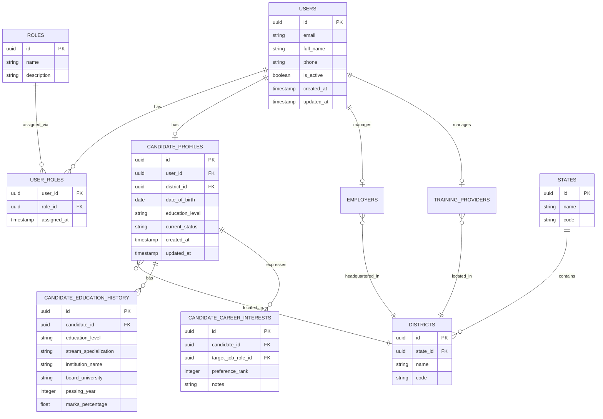
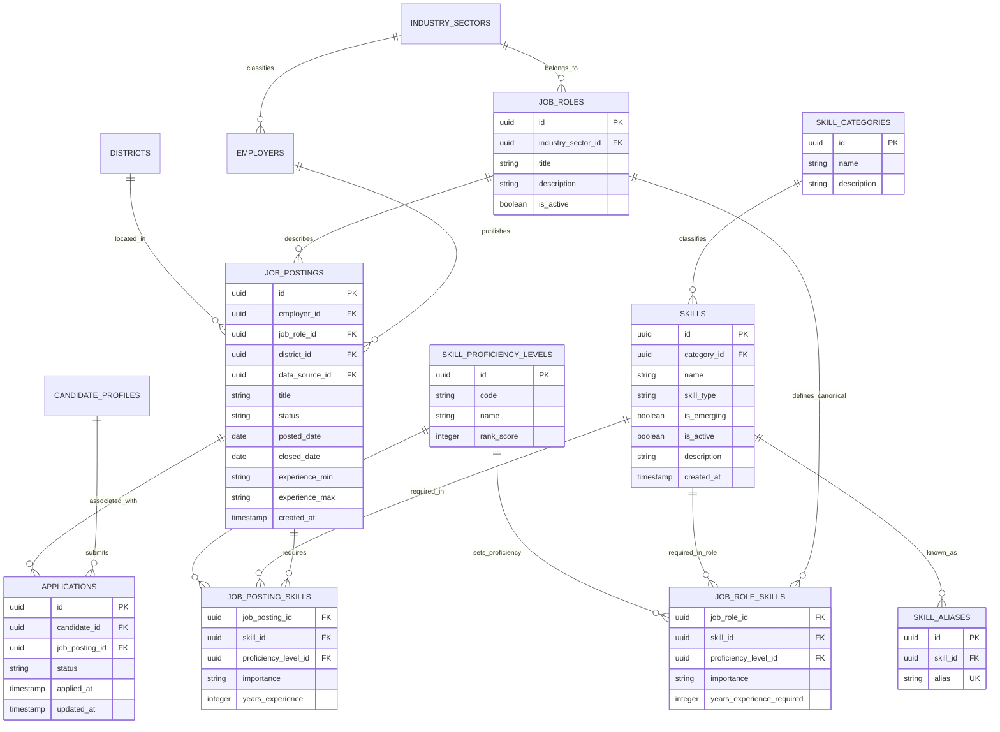
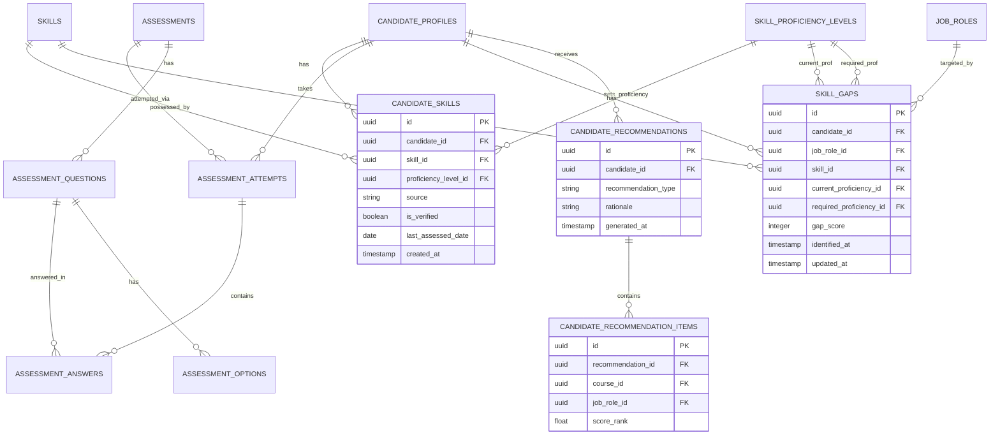
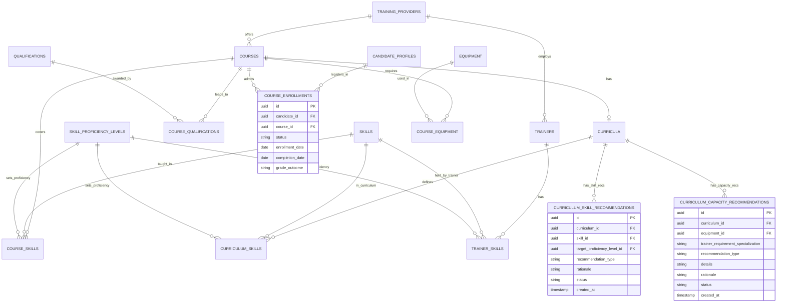
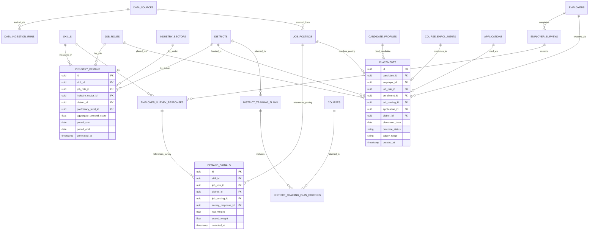

# SkillMitra — Entity Relationship Model

**SIH 2026 — Problem Statement 26134**  
**Phase 1: Database Architecture Design (Final Revision)**

> This document describes the conceptual ER model for SkillMitra. No SQL, tables, or migrations are created here.

---

## 1. System Overview

SkillMitra is a Labour Market Intelligence and Curriculum Alignment Platform. Its database must:

- Track real job market demand by skill, role, location, and time.
- Profile candidates (students/trainees) including their education streams, career interests, current skills, and identify their skill gaps against canonical job role requirements.
- Persist recommendations (courses, job roles, career paths) generated for candidates.
- Map courses and qualifications to required skills, tracking active candidate participation through a clean course enrollment and outcome model.
- Model the complete student employment journey including actual job applications and placement results.
- Support curriculum revision recommendations (split logically into skill coverage and capacity/resource recommendations).
- Enable district-level training, trainer, and equipment planning.
- Allow employers to validate skill demand through surveys.
- Track raw signal sources (job postings, surveys) using direct foreign keys for referential integrity, applying weighting weights to compute aggregate industry demand analytics.
- Track data ingestion from multiple external sources.
- Support future AI/ML semantic skill matching via pgvector.

The canonical term for student/trainee throughout the database is **candidate**.

---

## 2. Domain Boundaries

| Domain | Description | Type |
|---|---|---|
| Identity & Access | Users, roles, user roles | Transactional |
| Geography | States, districts | Reference |
| Profiles & Background | Candidate profiles, education history, career interests, employers, training providers | Transactional |
| Skill Taxonomy | Canonical skills, categories, aliases (unique constraints), proficiency levels | Reference |
| Job Market | Job roles, required skills (job_role_skills), job postings, required posting skills | Transactional |
| Job Applications | Candidate job applications mapping postings to profiles | Transactional |
| Courses & Outcomes | Qualifications, courses, course skills, enrollments | Transactional |
| Candidate Skills & Assessment | Candidate skills, assessments, attempts, answers | Transactional |
| Recommendation Engine | Candidate recommendations, recommendation items | Transactional (Persisted Log) |
| Skill Gap | Gap analysis between candidate skills and job requirements | Derived |
| Industry Demand | Weighted demand signals and aggregate demand analytics | Transactional + Analytical |
| Employer Validation | Employer surveys and validation responses | Transactional |
| Placement Outcomes | Actual hiring records (excludes non-placement states, 0..1 per course enrollment) | Transactional |
| Curriculum | Curriculum versions, skill coverage, skill and resource recommendations | Transactional + Derived |
| Training Capacity | Trainers, trainer skills, equipment, course equipment requirements | Transactional |
| District Planning | District training plans, target courses | Derived |
| Data Sources | External data source registry and ingestion logs | Operational |

---

## 3. Transactional vs Analytical Data

### Transactional (Source of Truth)
- `users`, `roles`, `user_roles`
- `candidate_profiles`, `candidate_education_history`, `candidate_career_interests`
- `employers`, `training_providers`
- `skill_proficiency_levels`, `skill_categories`, `skills`, `skill_aliases` (unique constraint)
- `job_roles`, `job_role_skills` (canonical requirements), `job_postings`, `job_posting_skills`
- `applications` (tracks job application state)
- `courses`, `course_skills`, `course_qualifications`, `course_enrollments`
- `candidate_skills`, `assessments`, `assessment_questions`, `assessment_options`, `assessment_attempts`, `assessment_answers`
- `candidate_recommendations`, `candidate_recommendation_items` (persisted engine outputs)
- `employer_surveys`, `employer_survey_responses`
- `placements` (only actual placement outcomes)
- `trainers`, `trainer_skills`, `equipment`, `course_equipment`
- `curricula`, `curriculum_skills`, `curriculum_skill_recommendations`, `curriculum_capacity_recommendations`
- `data_sources`, `data_ingestion_runs`

### Analytical / Derived (Computed from Transactional)
- `demand_signals` — raw weighted demand records mapped from job postings and surveys
- `industry_demand` — aggregated/derived analytical demand rollup computed via an aggregation process
- `skill_gaps` — computed from candidate_skills vs job_role_skills
- `district_training_plans`, `district_training_plan_courses`

---

## 4. Core Entity Groups

- **Group A — Identity & Profiles:** `users`, `roles`, `user_roles`, `candidate_profiles`, `candidate_education_history`, `candidate_career_interests`, `employers`, `training_providers`
- **Group B — Geography:** `states`, `districts`
- **Group C — Skill Taxonomy:** `skill_proficiency_levels`, `skill_categories`, `skills`, `skill_aliases`
- **Group D — Job Market & Applications:** `job_roles`, `job_role_skills`, `job_postings`, `job_posting_skills`, `applications`
- **Group E — Courses & Enrollments:** `qualifications`, `courses`, `course_skills`, `course_qualifications`, `course_enrollments`
- **Group F — Candidate Skills & Assessments:** `candidate_skills`, `assessments`, `assessment_questions`, `assessment_options`, `assessment_attempts`, `assessment_answers`
- **Group G — Recommendation Engine:** `candidate_recommendations`, `candidate_recommendation_items`
- **Group H — Skill Gap:** `skill_gaps`
- **Group I — Industry Demand:** `demand_signals`, `industry_demand` (generated via aggregation process)
- **Group J — Employer Validation:** `employer_surveys`, `employer_survey_responses`
- **Group K — Placement Outcomes:** `placements` (only actual placement outcomes)
- **Group L — Curriculum:** `curricula`, `curriculum_skills`, `curriculum_skill_recommendations`, `curriculum_capacity_recommendations`
- **Group M — Training Capacity:** `trainers`, `trainer_skills`, `equipment`, `course_equipment`
- **Group N — District Planning:** `district_training_plans`, `district_training_plan_courses`
- **Group O — Data Sources:** `data_sources`, `data_ingestion_runs`

---

## 5. ER Diagrams

---

### 5.1 — Identity, Geography & Candidate Profiles



---

### 5.2 — Skill Taxonomy, Job Roles, Job Market & Applications



---

### 5.3 — Candidates, Skills, Assessments & Recommendations



---

### 5.4 — Courses, Qualifications, Enrollments & Curriculum



---

### 5.5 — Analytics, Placements & District Planning



---

## 6. Cardinalities Summary

| Relationship | Cardinality | Junction Table / Link |
|---|---|---|
| users → user_roles | 1 : Many | `user_roles` |
| candidate_profiles → candidate_education_history | 1 : Many | — |
| candidate_profiles → candidate_career_interests | 1 : Many | — |
| skill_proficiency_levels → skills | 1 : Many | — |
| job_roles ↔ skills | Many : Many | `job_role_skills` |
| skill_aliases | 1 : Many (Unique alias) | — |
| job_postings → demand_signals | 1 : Many | Enforced via `job_posting_id` FK (nullable) |
| employer_survey_responses → demand_signals | 1 : Many | Enforced via `survey_response_id` FK (nullable) |
| candidate_profiles → applications | 1 : Many | — |
| job_postings → applications | 1 : Many | — |
| applications → placements | 1 : 0..1 | One successful application has at most one placement record |
| job_postings → placements | 1 : Many | Placements track the origin job posting |
| course_enrollments → placements | 1 : 0..1 | One enrollment has zero or one primary placement outcome |
| candidate_profiles → candidate_recs | 1 : Many | — |
| candidate_recs → candidate_rec_items | 1 : Many | — |

---

## 7. Future pgvector Integration

No changes. Semantic skill mappings will be implemented in a future phase using `skill_embedding vector(384/1536)` on the `skills` table.

---

## 8. Design Assumptions

| # | Assumption |
|---|---|
| 1 | Candidate education history and career preferences are essential for career guidance routing. |
| 2 | `placements` table exclusively logs actual job/employment placements. Unplaced trainees are monitored through `course_enrollments` outcome status (`dropped`, `completed`). |
| 3 | `skill_aliases` enforces unique constraints globally so that an alias maps to only one canonical skill. |
| 4 | Controlled vocabulary for proficiencies is replaced by the central reference table `skill_proficiency_levels`. |
| 5 | Demand is calculated by weighting raw signals: `job_postings` and `employer_survey_responses` are recorded as `demand_signals` and aggregated via an aggregation process into `industry_demand`. |
| 6 | Curriculum recommendations are split into `curriculum_skill_recommendations` and `curriculum_capacity_recommendations` to keep concern separation. |
| 7 | Persisted recommendations in `candidate_recommendations` and `candidate_recommendation_items` enable recommendation history auditing. |
| 8 | **Referential Integrity on Demand Signals**: Polymorphic associations are avoided. `demand_signals` uses explicit nullable foreign keys `job_posting_id` and `survey_response_id` with a Check constraint requiring exactly one to be set. |
| 9 | **Trainee-to-Placement Restriction**: One `course_enrollments` record maps to at most one `placements` record (1:0..1 cardinality). |
| 10 | **Recommendation Items Constraint**: `candidate_recommendation_items` enforces a Check constraint requiring exactly one of `course_id` or `job_role_id` to be populated (the other must be NULL). |

---

## 9. Design Review: Student Journey Representation Verification

The schema fully maps the requested candidate journey:

```
Student (users + candidate_profiles)
  ↓
education/stream (candidate_education_history)
  ↓
career interest (candidate_career_interests)
  ↓
job role (job_roles)
  ↓
required skills (job_role_skills)
  ↓
current skills (candidate_skills)
  ↓
skill gap (skill_gaps)
  ↓
recommended course (candidate_recommendations + candidate_recommendation_items)
  ↓
course skills (course_skills)
  ↓
training (course_enrollments)
  ↓
job application (applications)
  ↓
job posting (job_postings)
  ↓
placement (placements)
```

**Verification Status:** All paths are connected via explicit Foreign Keys. No orphans exist. Checklist fully verified. ✅

---

*SkillMitra Phase 1 — Database Design Only — No SQL implemented*
