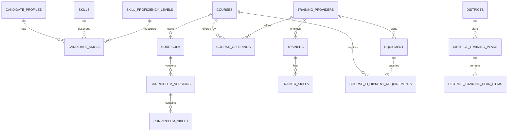

# SkillMitra Phase 4 Architecture

## Problem Addressed

Phase 4 connects candidate skills, curriculum, training supply, trainer capability, equipment, and district planning to the existing demand and placement data. It is deterministic and database-backed; it does not add ML, scraping, or fabricated analytics.

## Existing Entities Reused

`states`, `districts`, `users`, `candidate_profiles`, `skills`, `skill_proficiency_levels`, `job_roles`, `job_role_skills`, `courses`, `course_skills`, `course_enrollments`, `applications`, `placements`, and `industry_demand` remain canonical sources of geography, skills, proficiency, job requirements, training, demand, and outcomes.

## New Entities

- `candidate_skills`: candidate, skill, proficiency, source, verification status, assessment date, and timestamps.
- `curricula`: course curriculum identity and description.
- `curriculum_versions`: immutable version number and effective dates.
- `curriculum_skills`: version-to-skill mapping with target proficiency, importance, and ordering.
- `training_providers`: provider identity, owning user, district, and status.
- `course_offerings`: provider-course-district offering with sanctioned, active, and utilized seats.
- `trainers`: provider-owned trainer profile and status.
- `trainer_skills`: trainer proficiency and verification.
- `equipment`: provider-owned equipment type, quantity, and status.
- `course_equipment_requirements`: course equipment requirements and quantity.
- `district_training_plans`: auditable district planning period and status.
- `district_training_plan_items`: plan role/skill/proficiency targets, demand and supply values, and deterministic gap.

## Relationships and Cardinalities

## Normalization and Constraints

- Candidate, curriculum, trainer, and course skill names are never duplicated; all reference `skills`.
- Proficiency names and ordering are sourced from `skill_proficiency_levels`.
- Junction tables use composite unique constraints where appropriate.
- Capacity and equipment quantities are non-negative integers; active capacity cannot exceed sanctioned capacity.
- Status values use database check constraints.
- Curriculum version numbers are unique per curriculum and are not overwritten.
- Provider-course-district offerings are unique.
- All relationships use explicit foreign keys with restrictive or set-null deletion appropriate to historical data.

## Candidate Skills and Skill Gaps

`candidate_skills` records claims and evidence status. Skill gaps are derived at request time by comparing candidate skill IDs and proficiency `rank_score` to `job_role_skills`. A skill is matched when candidate rank is at least required rank; missing skills have no candidate row; insufficient skills have a lower candidate rank. No `skill_gaps` snapshot table is created.

## Curriculum Versioning

A course owns one or more curricula. Each curriculum has immutable numbered versions. `courses.current_curriculum_version_id` identifies the active version while historical versions remain queryable. Skills and target proficiency belong to a version, not directly to a mutable curriculum identity.

## Provider Capacity

`course_offerings` is the operational provider-course-district relationship. `sanctioned_seats` is the approved seat limit, `active_seats` is currently usable capacity, and `utilized_seats` is seats currently occupied. Available seats are `active_seats - utilized_seats`, with a check preventing negative availability.

## Trainer and Equipment Capability

Trainer skills provide proficiency evidence for provider staff. Equipment inventory records available quantity and operational status. Course equipment requirements record required quantity. Equipment gap is calculated as `max(required - available, 0)` only within the same provider and district.

## District Planning and Demand vs Supply

A plan item scopes one district, planning period, skill/role/proficiency, and optional course. `demand_value` is the persisted aggregate demand score for the selected period; `supply_value` is active available seats from course offerings mapped to the selected course skills. `gap_value = demand_value - supply_value`. These values are nullable until a service computes them for a fully specified scope; no arbitrary target or rate is generated.

## Placement Outcomes

Existing `course_enrollments`, `applications`, and `placements` remain the source of outcome counts. Placement rates remain unsupported unless a service defines a single cohort, denominator, filters, and time window.

## API and Security Boundaries

Candidate skill and gap APIs are candidate-owned. Provider, trainer, equipment, offering, and capacity APIs enforce provider ownership. Government planning and supply APIs require `government_admin`. Public course and demand reads expose no private assessment evidence, employer secrets, or provider-private details.

## Unsupported Capabilities

Emerging technology trends, sector growth data, employer curriculum validation, forecasting, ML recommendations, scraping, and defensible obsolete/oversupply classifications remain **NOT_YET_AVAILABLE** until source data and approved formulas exist.
